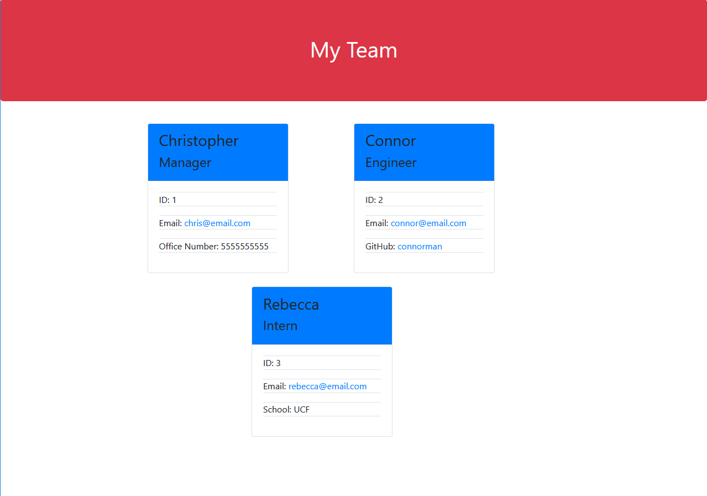
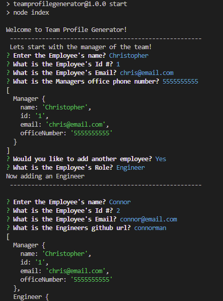

# Team Profile Generator

## About

This Node.js command-line application takes in information about employees on a software engineering team, then generates an HTML webpage that displays summaries for each person. 

## Table of Contents
  
  [About](#about)
  [User Story](#user-story)
  [Preview](#preview)
  [Installation](#installation)
  [Tests](#tests)
  [License](#license)

## User Story

AS A manager
I WANT to generate a webpage that displays my team's basic info
SO THAT I have quick access to their emails and GitHub profiles

## Preview

The following image shows a mock-up of the generated HTML’s appearance and functionality:

The following image shows what the console looks like when starting the program

  
## Installation
  
  1. Clone The Repo Down
  2. Run ` npm install `
  3. Run ` npm start `

## Tests

For Testing purposes make sure you have Jest installed which should have occured when installing the other packages
  then Run ` npm test `
  
## License

